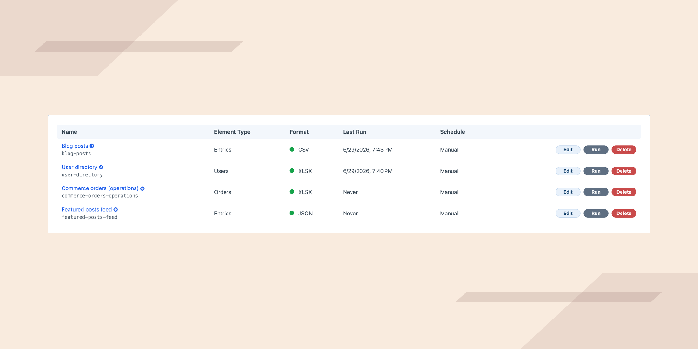
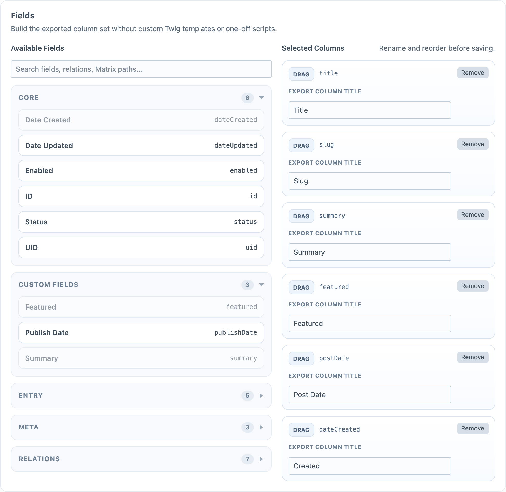
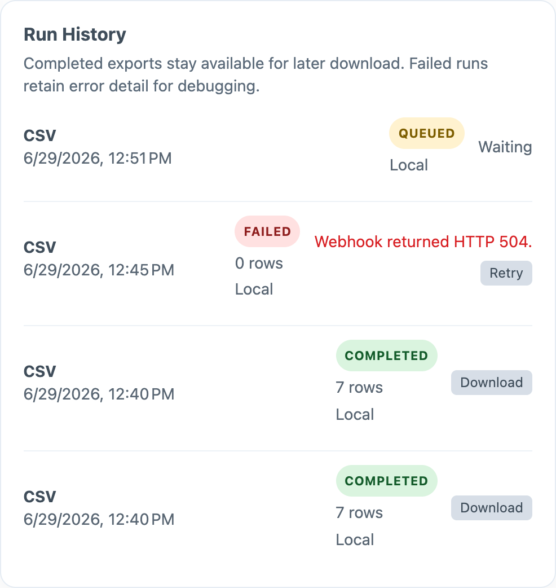
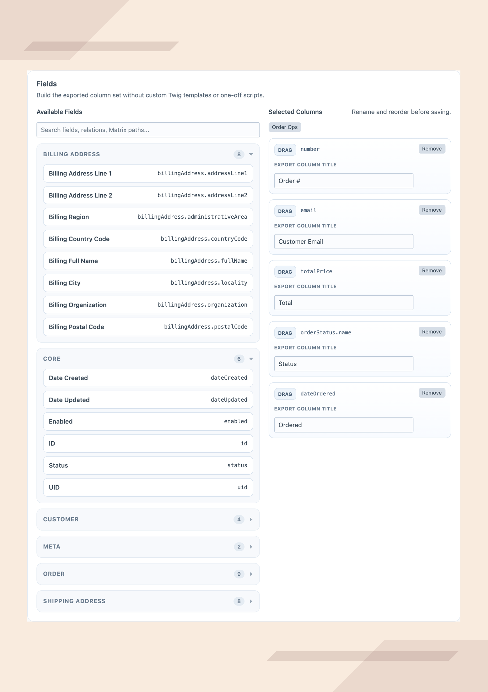

<p align="center">
  
</p>

<h1 align="center">Data Export Builder</h1>

<p align="center">
  Reusable CSV, JSON, and XLSX exports for Craft CMS — define an export once, run it on demand.
</p>

<p align="center">
  <a href="https://plugins.craftcms.com/data-export-builder"></a>
  
  
  
  
</p>

---

**Data Export Builder** gives Craft CMS teams a reusable export workflow for reporting, migrations, operational handoffs, and Commerce data movement. Instead of rebuilding one-off export templates or custom scripts every time a client asks for data, define an export once, save it, and run it again whenever you need it. Small exports run immediately; larger exports run through the Craft queue and stay available for download from run history.

Built for agencies, freelancers, and in-house Craft teams that repeatedly need clean exports without turning every request into bespoke development work.

## Features

- 📤 **Export the elements you actually use** — entries, users, categories, tags, and assets, plus Commerce orders, products, and variants in Pro.
- 📝 **Export form submissions (Pro)** — [Formie](https://plugins.craftcms.com/formie) and [Wheelform](https://plugins.craftcms.com/wheelform) submissions, filtered by form.
- 🧩 **Pick fields without code** — native attributes, custom fields, relation fields, and practical Matrix sub-field paths, all from one field picker.
- 🔃 **Shape the output** — rename and reorder columns, and choose CSV, JSON, or XLSX.
- 🔍 **Filter precisely** — by section, site, form, status, keyword, created date, relations, and selected field values where supported.
- ⚡ **Start from presets** — one-click Commerce starting points (Order Ops, Catalog Feed, Inventory Feed) prefill sensible columns.
- ♻️ **Reuse everything** — save export templates and run them again on demand.
- ⏱️ **Scale safely** — small exports run immediately; larger ones queue and download later from run history.
- 🤖 **Automate (Pro)** — schedule recurring exports and deliver them by email, webhook, or to a Craft asset volume.

## Screenshots

<p align="center"></p>
<p align="center"><em>The Exports index — every saved template, ready to run.</em></p>

<p align="center"></p>
<p align="center"><em>Build a template: choose an element type, pick fields, rename and reorder columns.</em></p>

<p align="center"></p>
<p align="center"><em>Run history with queued, completed, and failed runs.</em></p>

<p align="center"></p>
<p align="center"><em>A Commerce order export template (Pro).</em></p>

## Requirements

- PHP 8.2+
- Craft CMS 5.0+
- Craft queue configured (for larger exports)
- Craft Commerce (optional, for order/product/variant exports)
- Formie or Wheelform (optional, for form submission exports — Pro edition)

## Installation

Install from the **Plugin Store** in the Craft Control Panel (search for *Data Export Builder*), or with Composer:

```bash
composer require luremo/craft-data-export-builder
php craft plugin/install data-export-builder
```

Then grant the plugin permissions to the right user groups.

## Quick Start

1. Open **Exports** in the Craft Control Panel.
2. Create a new export template.
3. Choose an element type.
4. Add the fields you want to export.
5. Rename and reorder the selected columns.
6. Apply filters if needed.
7. Save the template.
8. Run the export.
9. Download the completed file from run history.

## Supported Element Types

| Element Type     | Standard | Pro |
| ---------------- | :------: | :-: |
| Entries              |    ✓     |  ✓  |
| Users                |    ✓     |  ✓  |
| Categories           |    ✓     |  ✓  |
| Tags                 |    ✓     |  ✓  |
| Assets               |    ✓     |  ✓  |
| Formie Submissions †  |    —     |  ✓  |
| Wheelform Submissions †|   —     |  ✓  |
| Commerce Orders ‡    |    —     |  ✓  |
| Commerce Products ‡  |    —     |  ✓  |
| Commerce Variants ‡  |    —     |  ✓  |

† Pro edition; available when the [Formie](https://plugins.craftcms.com/formie) or [Wheelform](https://plugins.craftcms.com/wheelform) plugin is installed and enabled.
‡ Requires [Craft Commerce](https://plugins.craftcms.com/commerce) and the Pro edition.

## Supported Output Formats

| Format | Standard | Pro |
| ------ | :------: | :-: |
| CSV    |    ✓     |  ✓  |
| JSON   |    ✓     |  ✓  |
| XLSX   |    —     |  ✓  |

## Field Support

The field picker includes:

- native element attributes
- common meta values like title, slug, uri, status, and dates
- custom fields
- relation fields
- practical Matrix sub-field paths

Dates are normalized to `Y-m-d H:i:s`. CSV output uses native `fputcsv()` escaping for commas, quotes, and multiline values. Relation values export as comma-separated readable values in CSV, and as arrays where practical in JSON.

## Queue Behavior

- Each template has a queue threshold.
- Exports at or below the threshold run immediately.
- Larger exports create a queued export run.
- Completed runs remain downloadable from the template screen.
- Failed runs store an error message.

## Automation & Delivery (Pro)

Configure automation per export template under **Settings**:

- Scheduled exports are queued by running `php craft data-export-builder/scheduler/run`. When a scheduled run is due, the plugin creates a normal export run for that template.
- **Email delivery** sends the exported file as an attachment.
- **Webhook delivery** posts the export payload and file to the configured endpoint.
- **Remote storage** uploads a copy to a selected Craft asset volume. *Keep local downloadable copy* retains the local run file after upload.
- Failed runs stay in run history and can be retried from the Control Panel.

## Permissions

- `manageDataExports`
- `runDataExports`
- `downloadDataExports`

## Data Handling & Retention

Exports can contain personal data (user records, Commerce order and customer details). Handle the output accordingly:

- Completed export files are written to Craft's storage and remain on disk until you delete the run from run history. They are not auto-expired.
- Download access is gated by the `downloadDataExports` permission.
- Pro webhook delivery posts the export payload to your configured endpoint; the endpoint URL and any secret you set are stored in the template config. Use HTTPS endpoints and rotate secrets if exposed.
- Pro email delivery sends the exported file as an attachment to the addresses you configure.
- For sites with data-retention obligations, periodically prune old runs (and any remote copies) so exported personal data is not retained longer than needed.

## Editions

Data Export Builder declares native Craft plugin editions:

- **Standard** — general content exports (CSV, JSON).
- **Pro** — Commerce-focused workflows, XLSX, scheduling, and delivery.

| Edition  | Price |
| -------- | ----- |
| Standard | $29   |
| Pro      | $69   |

Set the edition through Craft plugin editions, not environment variables. Craft stores the active edition in project config; change it via `plugins.data-export-builder.edition` when testing edition-gated behavior locally. See [docs/pricing-edition-notes.md](docs/pricing-edition-notes.md) for edition rationale and pricing direction after launch validation.

## Support

- **Bug reports:** [GitHub Issues](https://github.com/LuremoDigital/Data-export-builder/issues) (please include reproduction steps).
- **Commercial support:** contact Luremo through the [Craft Plugin Store listing](https://plugins.craftcms.com/data-export-builder).
- **Changelog:** [CHANGELOG.md](CHANGELOG.md)

## License

Commercial. See [LICENSE.md](LICENSE.md). Licenses are sold through the [Craft Plugin Store](https://plugins.craftcms.com/data-export-builder).

---

<p align="center">Built by <a href="https://github.com/LuremoDigital">Luremo</a> for the Craft CMS community.</p>
